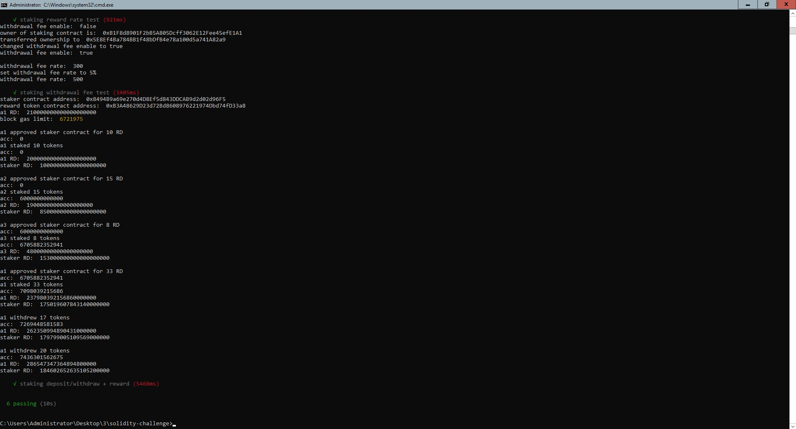

# Challenge
Create and deploy (locally) an ERC20 token and a staking contract that will distribute rewards to stakers over time. No need for an app or UI. You can reuse published or open source code, but you must indicate the source and what you have modified.

## Deliverable
Create a PR from this repository and add all your codebase, tests, requirements and tool usage to your README.md

## User journey
An account with some balance of the tokens can deposit them into the staking contract (which also has the tokens and distributes them over time). As the time goes by and blocks are being produced, this user should accumulate more of the tokens and can claim the rewards and withdraw the deposit.

## RewardToken.sol
This contract defines an ERC20 token that will be used for staking/rewards. The owner should be able to mint the token, change reward rates and enable/disable withdraw fees (also modifiable)

## Staker.sol
This contract will get deployed with some tokens minted for the distribution to the stakers. And then, according to a schedule, allocate the reward tokens to addresses that deposited those tokens into the contract. The schedule is up to you, but you could say that every block 100 tokens are being distributed; then you'd take the allocated tokens and divide by the total balance of the deposited tokens so each depositor get's proportional share of the rewards. Ultimately, a user will deposit some tokens and later will be able to withdraw the principal amount plus the earned rewards. The following functions must be implemented: deposit(), withdraw()

## Scoring criteria
- launch ERC20 token
- implement reward allocation logic
- safe deposit/withdraw functions (avoid common attack vectors)
- add test cases

## Tools
Recommended tools:
- Hardhat
- Truffle/Ganache
- Remix
- web3.js/ethers.js

## Running Environment

At first you can clone git repository

```
git clone https://github.com/crypto-wolf-1203/solidity-challenge.git
```

Now you open command prompt and move to the cloned directory.

```
cd solidity-challenge
```

You install node package of the following

```
npm install @openzeppelin/contracts
npm install big-number
npm install web3
```

To use truffle environment, you install node package for truffle.

```
npm install --global truffle
```

To compile smart contracts

```
truffle compile
```

## Testing smart contracts

To test smart contracts, you first run ganache tool for local chain.

To run local chain with id 1337, don't forget to add command line "-i 1337" to ganache-cli command.

```
npm install --global ganache-cli
ganache-cli --port 7545 -i 1337
```

To deploy smart contracts on local chain, please run

```
truffle migrate
```

this command will run automatically compilation.

To test smart contracts by use cases, run the following command.

```
truffle test
```

this command will run automatically "compile" and "migrate".

The result is as follows.



```
C:\Users\Administrator\Desktop\3\solidity-challenge>truffle test
Using network 'development'.


Compiling your contracts...
===========================
> Compiling .\contracts\Migrations.sol
> Compiling .\contracts\RewardToken.sol
> Compiling .\contracts\SafeTransferERC20.sol
> Compiling .\contracts\Staker.sol
> Compiling .\node_modules\@openzeppelin\contracts\access\Ownable.sol
> Compiling .\node_modules\@openzeppelin\contracts\security\ReentrancyGuard.sol
> Compiling .\node_modules\@openzeppelin\contracts\token\ERC20\ERC20.sol
> Compiling .\node_modules\@openzeppelin\contracts\token\ERC20\IERC20.sol
> Compiling .\node_modules\@openzeppelin\contracts\token\ERC20\extensions\IERC20Metadata.sol
> Compiling .\node_modules\@openzeppelin\contracts\utils\Address.sol
> Compiling .\node_modules\@openzeppelin\contracts\utils\Context.sol
> Compiling .\node_modules\@openzeppelin\contracts\utils\math\SafeMath.sol
> Artifacts written to C:\Users\ADMINI~1\AppData\Local\Temp\2\test--4592-NUnIKhS8VTdv
> Compiled successfully using:
   - solc: 0.8.10+commit.fc410830.Emscripten.clang

token address:  0xB3A48629D23d72Bd8608976221974Dbd74fD33a8
staker address:  0x8494B9a69e270d4D8Ef5d843DDCAB9d2d02d96F5


  Contract: RewardToken test
accounts:  [
  '0x5E8Ef4Ba784BB1f48bDfB4e78a100d5a741A82a9',
  '0xB1F8d8901F2bB5A805Dcff3062E12Fee45efE1A1',
  '0x6dfA8Ead4AaF2FE4516440E202A8A63C388fdce0',
  '0xA66D3C0A9C31BB49D71a36B8f8439EC76bF9E87c',
  '0x31e5624Aef2f2008f0f39cc54f93bCCE86D0aEB1',
  '0xd1321A0D503176697c0Ed502100e3c73B3579a11',
  '0x5F25E3fc836a192dC0046AB38cC60539d915246e',
  '0x7CBbEE1db08273c9BfC6FF78AF25433fAe7e5827',
  '0xA119145c28a5105386C57Ac3790a825068A5679c',
  '0x7a824fC2152d41Fc9dBDF161f241BD37248eaCFd'
]
    √ account log
a1 ether:  99837940440000000000
a2 ether:  100000000000000000000

    √ ether testing (51ms)
a1 RD:  300000000000000000000
a1 => a2: 34RD
a1 RD:  266000000000000000000
a2 RD:  34000000000000000000

a1 => a3: 56RD
a1 RD:  210000000000000000000
a2 RD:  34000000000000000000
a3 RD:  56000000000000000000

    √ first account distributes some of its balance to the second and the third (1619ms)
reward rate:  100000000000000000000
owner of staking contract is:  0x5E8Ef4Ba784BB1f48bDfB4e78a100d5a741A82a9
transferred ownership to  0xB1F8d8901F2bB5A805Dcff3062E12Fee45efE1A1
changed reward rate to 30 tokens
reward rate:  30000000000000000000

    √ staking reward rate test (921ms)
withdrawal fee enable:  false
owner of staking contract is:  0xB1F8d8901F2bB5A805Dcff3062E12Fee45efE1A1
transferred ownership to  0x5E8Ef4Ba784BB1f48bDfB4e78a100d5a741A82a9
changed withdrawal fee enable to true
withdrawal fee enable:  true

withdrawal fee rate:  300
set withdrawal fee rate to 5%
withdrawal fee rate:  500

    √ staking withdrawal fee test (1405ms)
staker contract address:  0x8494B9a69e270d4D8Ef5d843DDCAB9d2d02d96F5
reward token contract address:  0xB3A48629D23d72Bd8608976221974Dbd74fD33a8
a1 RD:  210000000000000000000
block gas limit:  6721975

a1 approved staker contract for 10 RD
acc:  0
a1 staked 10 tokens
acc:  0
a1 RD:  200000000000000000000
staker RD:  10000000000000000000

a2 approved staker contract for 15 RD
acc:  0
a2 staked 15 tokens
acc:  6000000000000
a2 RD:  19000000000000000000
staker RD:  85000000000000000000

a3 approved staker contract for 8 RD
acc:  6000000000000
a3 staked 8 tokens
acc:  6705882352941
a3 RD:  48000000000000000000
staker RD:  153000000000000000000

a1 approved staker contract for 33 RD
acc:  6705882352941
a1 staked 33 tokens
acc:  7098039215686
a1 RD:  237980392156860000000
staker RD:  175019607843140000000

a1 withdrew 17 tokens
acc:  7269448581583
a1 RD:  262350994890431000000
staker RD:  179799005109569000000

a1 withdrew 20 tokens
acc:  7436301562675
a1 RD:  286547347364894800000
staker RD:  184602652635105200000

    √ staking deposit/withdraw + reward (5468ms)


  6 passing (10s)


C:\Users\Administrator\Desktop\3\solidity-challenge>
```

## Analysis

Let's analyze the result of test.

a1 means the first account, a2 means the second account, a3 means the third account.

a1 is the owner of token and staker contract. (i.e. a1 account deployed both contracts on local chain)

At first, ganache local chain distribute 100 eth to every account.

a1 deployed 2 contract by consuming eth.

```
a1 ether:  99837940440000000000
```

RD stands for the name of token here.

On deploy of both contracts, a1 has 300 RD ( = 300 * (10 ** 18)) with 18 decimal points.

So a1 transfers 34RD to a2, 56RD to a3.

| account | token(RD) |
| ------- | --------- |
| a1      | 210       |
| a2      | 34        |
| a3      | 56        |

Reward rate is 100 RD by default. we change it to 30 RD.

```
changed reward rate to 30 tokens
```

withdrawal fee flag is false by default, we change it to true.

```
changed withdrawal fee enable to true
```

And we change the fee rate to 5% from 3% by default.

```
set withdrawal fee rate to 5%
```

And steps to deposit and withdraw are as follows

```
a1 deposits 10RD
a2 deposits 15RD
a3 deposits 8RD
a1 deposits 33RD
a2 withdraws 17RD
```

### Deposit and withdraw

a1, a2, a3 does not get reward tokens at first time of their deposit.

so a2, a3 do not get reward tokens.

Every account gets reward tokens when it makes a deposit or withdrawal after their first deposit.

a1 gets reward tokens three times because a1 did 4 times.

At second deposit, a1 is rewarded by 70.98RD.

At first withdrawal (third transaction), a1 is rewarded by 7.372RD.

At second withdrawal (fourth transaction), a1 is rewarded by .

So the token balance of a1 is 300 - 34(to a2) - 56(to a3) - 10(deposit) - 33(deposit) + 70.98(reward) + 17(withdraw) + 7.372(reward) + 20(withdraw) + 4.195(reward) = 286.547RD

Here I don't explain the exact share of a1, a2, a3 at each step of deposit and withdraw, and rewarding calculation.

For more explanation, please contact eUgeigne.

# Conclusion

The main focus of this challenge is to make exact staking algorithm.

I focused on 3 points.

- Security issue
- Optimization of gas fee
- Exact rewarding calculation

### Security issue

As you know, smart contracts are public codes. Any type of malware contracts will harm the logic of the contracts. 

I used reentrancy mechanism here to prevent it.

And here, the most important issue is safety of calculation.

Staking should calculate exact result of share and reward.

I used SafeMath for arithmetic operations for overflow/underflow security.

And while calculating share of each account, I extended percentage resolution to 1e12 to prevent rounding of division.

For more explanation, please contact eUgeigne.

### Optimization of gas fee

I would calculate share of reward for each user at each time of deposit/withdraw of some user.

That's a simple scheme but calculation complexity will be O(n) where n is the number of accounts in staking.

When n is enough small, gas fee is not remarkably high.

When trading is fully active and n grows big, one transaction will have O(n) gas fee, it is not desirable.

I used O(1) algorithm for share of reward.

For more explanation, please contact eUgeigne.

### Exact rewarding calculation

For O(1) algorithm, I had to establish exact rewarding and share rate calculation.

I introduced a rating rate per token at every transaction and integrated it with staked amount by subtracting already rewarded tokens.

For more explanation, please contact eUgeigne.

